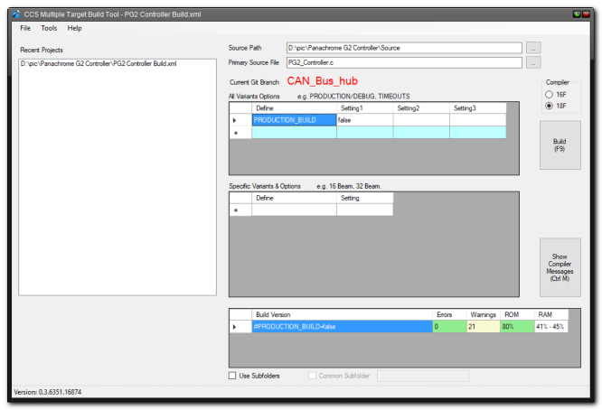

# ccs-builder README

(c) DKSS 2018

This provides a way of running the DKSS CCS builder application, so that it can initiate a compile of CCS source.

## Features

DKSS CCS Builder will build any specific CCS project. Use of this extension causes the build to take place, irrespective of open files.

While editor is active, press Ctrl-Shift-b

## Requirements

DKSS CCS builder must be installed, and running.

## Extension Settings

* `CCS.showBuildMessage`: enable/disable showing message that signal was created

## Release Notes

Initial version

### 0.0.1

Initial release of CCS Builder

### 0.0.2

Added config setting
Added key binding

# Contact Us

If you run into any issues or have suggestions, please raise issues on the [Github page](https://github.com/davekelly63/CCS_CodeBuilder)
